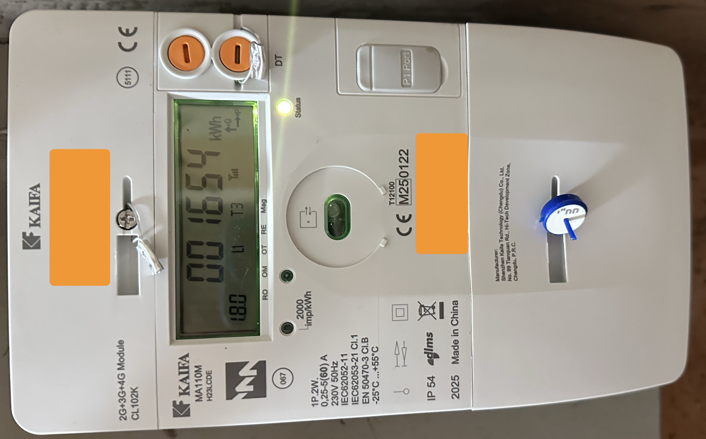
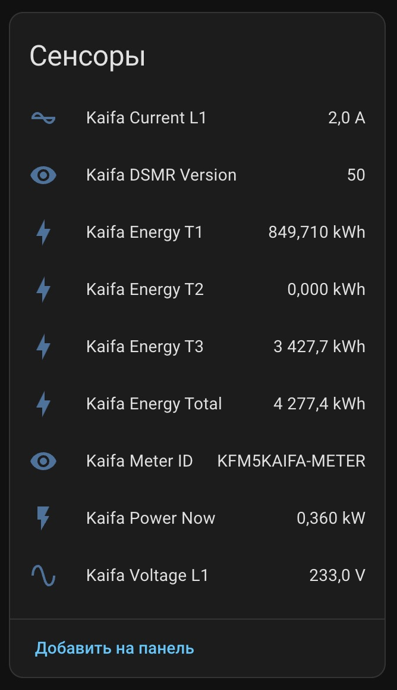
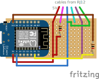

# IEC P1 ESPHome reader for Kaifa MA110M (Israel IEC)

This repository contains a simple DIY ESPHome firmware and wiring guide to read
**P1 port data** from an Israeli **Kaifa MA110M** electricity meter (IEC) and
publish it into **Home Assistant** over Wi-Fi.

I built and tested this on my own Kaifa MA110M (DSMR 5.0, 115200 8N1).  
Use it at your own risk and only if you are comfortable with basic soldering and
working around mains equipment.

---

## What you get

- ESPHome configs for **Wemos D1 mini (ESP8266)**:
  - [`esphome/kaifa_p1.yaml`](esphome/kaifa_p1.yaml) – normal version
  - [`esphome/kaifa_p1_debug.yaml`](esphome/kaifa_p1_debug.yaml) – debug version with raw P1 telegram logging
- Tested with **IEC Kaifa MA110M** smart meter (see photo below)
- Validated P1 wiring with simple 1 kΩ resistors
- Exposes the following sensors in Home Assistant:
  - Kaifa Energy T1 / T2 / T3
  - Kaifa Energy Total
  - (optional) grid export / returned energy sensors
  - Kaifa Power Now (instant power)
  - Kaifa Voltage L1
  - Kaifa Current L1
  - Kaifa Meter ID
  - Kaifa DSMR Version

---

## Disclaimer

- Everything here is provided **as-is**.
- You are responsible for what you connect to your meter.
- The design only *reads* data from the P1 port and is powered from the meter’s
  5 V line. In normal conditions you should not be able to damage the meter,
  but you **can absolutely kill your Wemos** if you wire things wrong.
- I’m not an electrician, just a nerd with a soldering iron.

If you are not comfortable with this, consider buying a ready-made device such
as **[Slimmelezer Plus](https://www.zuidwijk.com/product/slimmelezer-plus/)**.
It should work with Kaifa meters, but for me the shipping to Israel is roughly
the same price as the device itself – hence this project.

---

## Hardware overview

### Meter

IEC smart meter Kaifa MA110M with P1 port:

<p align="center">
  
</p>

P1 port is behind the plastic door at the bottom right.

---

### Home Assistant sensors

This is what you should see in Home Assistant when everything works:

<p align="center">
  
</p>

---

## Bill of materials

All links are just examples from AliExpress. Any equivalent parts with the same
specs should work.

### Core board

- **Wemos D1 mini (USB-C, ESP8266, with female headers)**  
  Example:  
  <https://aliexpress.com/item/1005006018009983.html>

<p>
  
</p>

---

### P1 / RJ12 related parts

You need something that can plug into the P1 port on the meter and break out
the 6 wires.

- **RJ12 6P6C data cable, male-to-male, straight wiring**  
  (goes from meter to your PCB)  
  Example:  
  <https://aliexpress.com/item/1005006226706163.html>

<p>
  
</p>

- **RJ12 6P6C PCB jack with pre-crimped wires (optional but handy)**  
  You solder only the wires, not the connector itself.  
  Example:  
  <https://aliexpress.com/item/1005005654491710.html>

<p>
  
</p>

Alternative: a cable with individual pre-crimped wires, which you solder
directly into the PCB instead of using an extra jack:  
<https://aliexpress.com/item/1005007821256603.html>

<p>
  
</p>

---

### Prototyping & passives

- **Prototyping PCB (about 3×7 cm)**  
  Example:  
  <https://aliexpress.com/item/1005004818919331.html>

<p>
  
</p>

- **Resistor kit** – you need only **1 kΩ** resistors (¼ W is fine)  
  Example:  
  <https://aliexpress.com/item/1005005855324735.html>

<p>
  
</p>

---

### FTDI P1 USB cable (for testing only)

This is used only to **test the P1 port & telegrams directly on your computer**
*before* you solder anything. You do **not** use it in the final ESP build.

- **Dutch Slimme Meter P1 Poort cable with FTDI FT232RL**  
  Example:  
  <https://aliexpress.com/item/1005008845878589.html>

<p>
  
</p>

---

## Wiring

### P1 pinout

The Kaifa MA110M P1 port is an RJ11/RJ12 **6P6C** connector.

With the plug facing you and the plastic clip **down**, pins are numbered
left-to-right **1 … 6**.

From the Kaifa manual (DSMR v5.0):

| Pin | Name       | Description      |
|-----|------------|------------------|
| 1   | +5 V       | Power supply     |
| 2   | Request    | Input            |
| 3   | Data GND   | Data ground      |
| 4   | N.C.       | Not connected    |
| 5   | Data       | P1 data output   |
| 6   | Power GND  | Power ground     |

For our design we treat pins **3 and 6 as GND** and tie them together.

---

### Schematic / wiring diagram

<p align="center">
  
</p>

All resistors in this design are **1 kΩ**.

**Connections:**

- **P1 pin 1 (+5 V)** → Wemos **5V** (or `VIN`)
- **P1 pin 2 (Request)** ← P1 pin 1 via **1 kΩ** resistor  
  (keeps the Request line high so the meter continuously sends telegrams)
- **P1 pin 3 (Data GND)** → Wemos **GND**
- **P1 pin 6 (Power GND)** → Wemos **GND** (tie together with pin 3)
- **P1 pin 5 (Data)** → Wemos **RX0 / GPIO3**  
  Additionally:
  - Wemos **3V3** → same RX0 node via **1 kΩ** resistor  
    (provides ~3.3 mA sink current for the meter’s optocoupler while
    keeping RX at safe 3.3 V levels)

There is **no direct connection** from the P1 port to any other Wemos pins.

> If your meter behaves strangely, the official spec wants 5–6 mA sink
> current on the data pin. You can lower the 1 kΩ resistor from 3V3 to
> ~680 Ω to get closer to that value. For my Kaifa MA110M, 1 kΩ works
> reliably.

---

## ESPHome firmware

### Files in this repo

- **Main firmware** – parses DSMR telegrams and exposes sensors  

  [`esphome/kaifa_p1.yaml`](esphome/kaifa_p1.yaml)

- **Debug firmware** – same UART settings, but logs raw telegrams using
  `uart.debug`  

  [`esphome/kaifa_p1_debug.yaml`](esphome/kaifa_p1_debug.yaml)

If your meter sends slightly different OBIS codes (e.g. for tariffs or export),
flash the **debug** config first, capture the raw telegrams, and adjust the
`dsmr` component mappings accordingly. If you’re not sure how, paste the raw
log and your YAML into ChatGPT (or similar) and ask it to tweak the config.

---

### Sensors exposed

The `kaifa_p1.yaml` config is tuned for my Kaifa MA110M and exposes:

- `sensor.kaifa_energy_t1` – OBIS `1-0:1.8.11`
- `sensor.kaifa_energy_t2` – OBIS `1-0:1.8.12`
- `sensor.kaifa_energy_t3` – OBIS `1-0:1.8.13`
- `sensor.kaifa_energy_total` – sum of T1+T2+T3
- `sensor.kaifa_power_now` – OBIS `1-0:1.7.0`
- `sensor.kaifa_voltage_l1` – OBIS `1-0:32.7.0`
- `sensor.kaifa_current_l1` – OBIS `1-0:31.7.0`
- `text_sensor.kaifa_meter_id` – header line (`/KFM5KAIFA-METER`)
- `text_sensor.kaifa_dsmr_version` – OBIS `1-3:0.2.8`

It also defines **export (returned) energy** sensors using OBIS codes:

- `1-0:2.8.11`, `1-0:2.8.12`, `1-0:2.8.13`  
  (on my setup they are all zero because I don’t feed power back to the grid)

If some of your sensors show as `unknown` in Home Assistant, you probably have
different OBIS codes or a different DSMR version. Use the debug firmware to
capture telegrams and adjust.

---

## Installing ESPHome

You have to install ESPHome yourself; this repo only provides the configs.

### Option 1 – Home Assistant add-on (recommended)

Follow the official guide:  
- **Getting started with ESPHome and Home Assistant**  
  <https://esphome.io/guides/getting_started_hassio.html>   

Very short version:

1. In Home Assistant, go to **Settings → Add-ons → Add-on Store**.
2. Search for **ESPHome**, install it and start the add-on.
3. Open ESPHome dashboard from the sidebar.

### Option 2 – Command line (ESPHome CLI)

Official guide:  
- **Getting started with the ESPHome command line**  
  <https://esphome.io/guides/getting_started_command_line.html>   

On your computer:

```bash
pip install esphome
````

or use Docker as described in the docs.

---

## Flashing the Wemos

You only need a USB data cable for the **first** flash; afterwards you can use
OTA.

### With Home Assistant ESPHome add-on

1. Plug the **Wemos D1 mini** into the computer running your browser.
2. In ESPHome dashboard click **+ New Device** → **Continue** → give it a name.
3. After ESPHome creates a stub config, click **Edit** and **replace** the
   generated YAML with the contents of [`esphome/kaifa_p1.yaml`](esphome/kaifa_p1.yaml)
   (or [`esphome/kaifa_p1_debug.yaml`](esphome/kaifa_p1_debug.yaml) for first tests).
4. Click **Install**, choose **Plug into this computer** and pick the correct
   serial port.
5. Wait for flashing to finish and the device to appear in ESPHome dashboard.

### With ESPHome CLI

From the root of this repo:

```bash
# First time (USB)
esphome run esphome/kaifa_p1.yaml
# or
esphome run esphome/kaifa_p1_debug.yaml
```

ESPHome will compile, then ask you to select the serial port. After a successful
flash, the node will appear on your Wi-Fi and future updates can be done OTA
(the same `esphome run` command, but it will use the IP instead of serial).

---

## Testing the P1 meter with the FTDI cable (before soldering)

Before you solder anything, it’s a good idea to check that:

* your meter actually sends P1 telegrams;
* your FTDI cable and drivers work.

### 1. Connect the FTDI P1 cable

1. Plug the RJ12 end into the P1 port on the meter.
2. Plug the USB end into your computer.
   The FT232RL should appear as a serial port:

   * Windows: `COMx` in Device Manager.
   * Linux: `/dev/ttyUSB0`, `/dev/ttyUSB1`, …
   * macOS: `/dev/tty.usbserial-XXXX` or similar.

If the port doesn’t show up, install FTDI drivers from the chip vendor.

### 2. Open a terminal session

For Kaifa MA110M with DSMR 5.0, the port settings are:

* **Baudrate:** `115200`
* **Data bits:** `8`
* **Parity:** `None`
* **Stop bits:** `1`
  (115200 8N1)

Examples:

**Linux:**

```bash
sudo apt install minicom    # if needed
minicom -b 115200 -D /dev/ttyUSB0
```

**macOS:**

```bash
brew install minicom        # optional
minicom -b 115200 -D /dev/tty.usbserial-XXXXXXXX
# or with screen:
screen /dev/tty.usbserial-XXXXXXXX 115200
```

**Windows:**

* Use PuTTY or similar.
* Select the COM port (e.g. `COM5`).
* Serial, 115200 baud, 8 data bits, no parity, 1 stop bit, no flow control.

The FTDI P1 cable usually takes care of pulling the **Request** line high
internally (RTS), so the meter will start sending telegrams every second.

### 3. What you should see

If everything is correct, you’ll see ASCII text like this repeating every
second:

```text
/KFM5KAIFA-METER

1-3:0.2.8(50)
0-0:1.0.0(251207001548W)
0-0:96.1.1(K06725)
1-0:1.8.11(000849.710*kWh)
1-0:1.8.12(000000.000*kWh)
1-0:1.8.13(003421.613*kWh)
1-0:2.8.11(000000.000*kWh)
1-0:2.8.12(000000.000*kWh)
1-0:2.8.13(000000.000*kWh)
0-0:96.14.1(03)
1-0:1.7.0(00.610*kW)
1-0:2.7.0(00.000*kW)
0-0:96.13.0()
1-0:32.7.0(232.0*V)
1-0:31.7.0(002.9*A)
1-0:99.1.0(1)(0-0:96.10.7)(1-0:1.29.0)(1-0:2.29.0)(251207001500W)(00)(000000.165*kWh)(000000.000*kWh)
!05F2
```

If you don’t see anything:

* Make sure the RJ12 is fully inserted into the meter.
* Check that the cable really is an FTDI **P1** cable (not just a generic RJ12).
* Double-check port speed and 8N1 settings.

Exit `minicom` with `Ctrl+A, X`, or `screen` with `Ctrl+A, \`.

Once this works, you know your meter and cable are OK. You can then reuse the
RJ12 side of the cable (or get a dedicated RJ12 data cable) for the ESP board.

---

## Using the debug ESPHome firmware

1. Flash [`esphome/kaifa_p1_debug.yaml`](esphome/kaifa_p1_debug.yaml).

2. Connect the Wemos board to the meter via your custom PCB and RJ12 cable.

3. In ESPHome:

   * **HA add-on:** open the node → click **Logs**.
   * **CLI:** run:

     ```bash
     esphome logs esphome/kaifa_p1_debug.yaml
     ```

4. You should see full telegrams and DSMR component messages. If CRC checks
   pass but some fields remain `unknown`, grab a few complete telegrams and
   open an issue / PR or ask an LLM to help adjust the OBIS mapping.

When everything looks correct, switch to the main firmware
[`esphome/kaifa_p1.yaml`](esphome/kaifa_p1.yaml) for normal operation.

---

## Home Assistant integration

Once the ESPHome node is on your Wi-Fi, Home Assistant should auto-discover it:

1. Go to **Settings → Devices & Services**.
2. Under **ESPHome**, click **Configure** for your `electricity-meter` device.
3. Approve the encryption key (the same as in the YAML).
4. You should then see the sensors as in the screenshot above.

From there, you can:

* Add the sensors to dashboards.
* Create utility meters, tariffs and statistics based on `Kaifa Energy Total`
  and per-tariff sensors.
* Automate notifications when power usage or voltage/current exceed thresholds.

---

## Alternatives and improvements

* This is a minimal, straightforward build. There are certainly more compact or
  elegant ways to do it (custom PCBs, different microcontrollers, etc.).
* If you feed power back to the grid, you’ll want to pay attention to the
  `2.8.*` OBIS codes and expose them as **export** sensors.
* Contributions are welcome: different meter models, different DSMR versions,
  better schematics, PCB layouts, etc.

---

## License

This project is licensed under the **MIT License**.
See [`LICENSE`](LICENSE) for details.